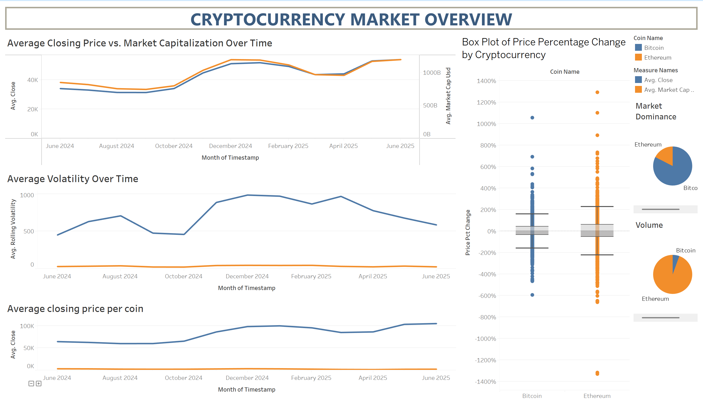

# 🔍 Crypto Forecasting & Prescriptive Trading Model

This project presents an end-to-end data analytics solution for **forecasting price movements** and generating **prescriptive trading signals** in the cryptocurrency market. By combining real-time market data, technical indicators, behavioral sentiment (Fear & Greed Index), and machine learning, it simulates a smart decision-making system for hourly crypto trading.

 📊 Focused Coins: **Bitcoin (BTC)** & **Ethereum (ETH)**  
 ⏱️ Frequency: Every 3 hours | Time Range: 1 Year

---

## 🧠 Project Highlights

- **Data Collection**:
  - Binance API for 1-hour OHLCV price data (resampled to 3h).
  - CoinGecko API for market cap.
  - Alternative.me API for Fear & Greed sentiment index.
  
- **Feature Engineering**:
  - Momentum-based indicators: RSI, MACD, Bollinger Bands.
  - Lag features, rolling volatility, volume anomalies.
  - Sentiment-based signal integration via Fear & Greed Index.

- **Target Variable**:
  - Classified price movement into: `Up`, `Down`, `Stable` (based on ±0.3% threshold).

- **Model Used**:
  - 🟩 LightGBM Classifier with isotonic probability calibration.
  - Addressed class imbalance using SMOTETomek.
  - Accuracy achieved: **79.6%** on entire dataset.

---

## 📈 Model Evaluation & Backtesting

- **Classification Report**:
  - Precision for 'Up': 0.82 | 'Down': 0.97
  - Balanced performance across classes.

- **Backtesting Strategy**:
  - Initial Cash: $10,000
  - Trade Allocation: 40% capital per trade
  - Prescriptive Rules:  
    - Stop Loss: **-1.5%**  
    - Take Profit: **+3.5%**  
    - Timeout Exit: **6 hours**
  - ✅ Final Portfolio Value: **$55,919.15**
  - Compared with 10 random strategies → Significantly outperformed

---

## 📌 Tableau Dashboard Insights

- Compared price trends, volatility, and market cap of BTC vs ETH.
- Volume behavior and dominance % across time.
- Ethereum shows higher trading frequency; Bitcoin shows stronger market dominance.

🖼️ _Dashboard Snapshot_  

---

## 🧠 Feature Importance

Visualizing LightGBM feature importance:  
- `Rolling Volatility`, `Lag Features`, and `Fear & Greed` were top predictors.

📷 _Feature Importance Plot_  

---

## 🧪 Classification Report

📷 _Full Evaluation Metrics_  

---

## 💰 Backtesting Results

📷 _Portfolio Growth Plot_  

---

## 🤖 Prescriptive Logic & 3-Hour Signals

- Signals are generated every 3 hours using model output probabilities.
- A decision tree converts calibrated class probabilities into Buy, Sell, or Hold actions.

📌 _Example Signal Output with Prescriptive Logic Tree_  

---

## 📌 Key Takeaways

- Accurate short-term classification of crypto price movement is possible with engineered indicators and calibrated models.
- Prescriptive trading logic enhanced with stop-loss/take-profit rules led to profitable backtesting.
- Bitcoin leads in stability and market dominance, while Ethereum shows higher trade engagement and utility-driven activity.

---

## ✅ Future Improvements

- 🗞️ Integrate real-time news & Twitter sentiment via NLP.
- 🧠 Add LSTM or temporal attention models for time-series forecasting.
- 🧪 Expand to more coins (e.g., BNB, Solana) and real-time strategy deployment.

---

## 👨‍💻 Author

**Mansehaj Singh Gill**  
📖 Master’s of Data Analytics

🔗 [LinkedIn](https://www.linkedin.com/in/mansehaj-singh-gill-333a82277)  
📂 [Project Repository](https://github.com/Mansehajgill/crypto-forecasting-prescriptive-model)

---
